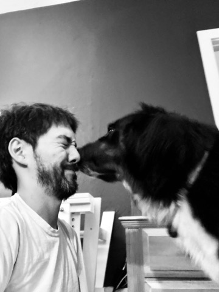
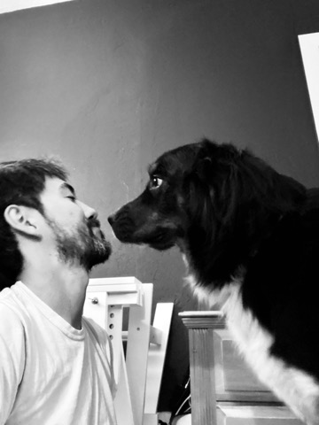

  
  
  

 

👋 hi hello. 

💻 I love to help teams build delightful experiences, and I'm grateful to have worked with some amazing humans: 💚 [Chime](https://chime.com/), 🟡 [One](https://onefinance.com/), 💳 [Simple](https://en.wikipedia.org/wiki/Simple_(bank)), 📱 [Apple](https://apple.com/). 

🌲 born in Boulder, Colorado, I've lived in DC, PDX and SF. 

✈️ ask me about my backpacking trip around the world! 

🶠my pup <a href="http://lyra.dog">Lyra</a> is my bff. 

☕️ let’s grab (a virtual) [coffee](https://calendly.com/benjaminchait)? 

💌 sign up for my [newsletter](https://benjaminchait.substack.com/subscribe)! 

🦠follow some silly [twitter](https://twitter.com/benjaminchait) words. 

📷 enjoy my [instagram](https://instagram.com/benjaminchait) ✨ stories ✨. 

👯‍♀️ we can be "friends" on [facebook](https://facebook.com/benjaminchait)! 

👔 make me a "connection" on [linkedin](https://linkedin.com/in/benjaminchait). 

👾 idk but [github](https://github.com/benjaminchait). 

 

❤️ always be kind.